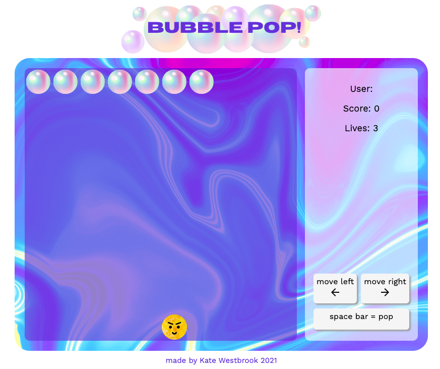
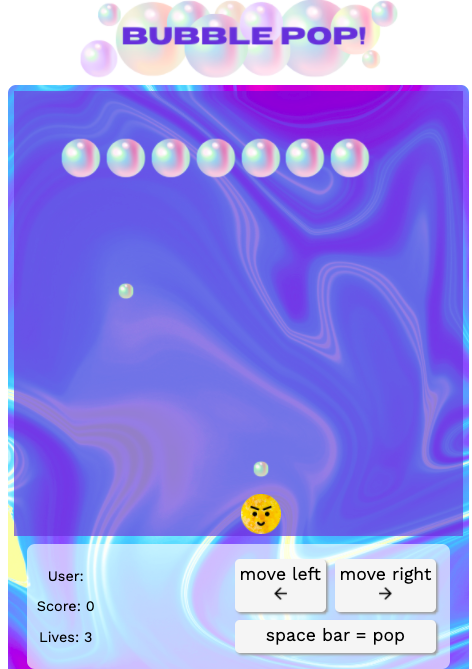

# Bubble Pop game

## Overview

This game (loosely based on the classic Space Invaders) is a bubble popping game built using JavaScript, HTML and CSS. It was my first full build project during the General Assembly Software Engineering Immersive bootcamp. This was a great chance to really put the skills I have learned in my first three weeks of coding to use, looking at how to plan and build a working and aesthetically pleasing game.

## Tech Stack

**Client:** JavaScript, CSS, HTML

## Brief

The brief for this project was to build a grid based clone of a classic arcade style game - I originally chose Snake, but was encouraged to try something a bit more challenging, so decided to take on Space Invaders.

 
Space Invaders is a classic arcade game from the 80s. The player aims to shoot an invading alien armada, before it reaches the planet's surface using a mounted gun turret.
 
The player can only move left or right. The aliens also move from left to right, and also down each time they reach the side of the screen. The aliens also periodically drop bombs towards the player.
 
Once the player has destroyed a wave of aliens, the game starts again. The aim is to achieve the highest score possible before either being destroyed by the aliens, or allowing them to reach the planet's surface.

## Features

- optimised for mobile and web using media queries
  

- human-readable code to ensure reusability
- aesthetically pleasing and functional UX
- enemies and characters designed by me!
   

- character selector menu - chosen character is playable in-game
- count down to play with a set timeout
- use of keyboard event listeners OR on-screen button clicks to move character and shoot
- score accumulator and lives decrementer
- collision detector to add score (if on enemy) or remove lives (if on character)

  
## Planning Process

First of all I wireframed out my project, looking at all of the HTML I would need for both a start page with character selecter and the game grid.

I then put together an overview of how I might develop the core features of this game using JavaScript. Some of these methods were used in the final game, but some of these features I modified or found alternative and better solutions for. Some of the "would like" features took a back seat to the minimum viable product, but are TBC as I continue working on the game!

[Complete planning document for the project](plan/Space-invaders-plan.md)

As well as using this plan for my game, I also mapped out some of the core algorithms and functionality using pen and paper. Here is a snippet of my thought process mapping for the enemy movement part of my code.

  

## Approach Taken

The main bulk of this project was heavily focussed on working out the logic of how a game like this could work. I started by building in the framework of the user journey, beginning with the start page, with a form and button to start. This would eventually include a selectable character and a name input that I planned to use for local storage high scores.

My next step was to build a numbered grid that forms the basis of all movement within the game. I then began to add the user - with movement dictated by key-presses and on-screen buttons (for mobile), and how the “bullet” would shoot (ie. initially on key-press and then automatically upwards until the end of the page). I also had to work out how the enemies would appear on screen, and move automatically across and then down, whilst also releasing random bullets that move automatically downwards. I spent a lot of time defining which grid squares were the edges of the board, and then how each different moving element would respond when it hit that square.

During one of the days of the project, I focussed on the CSS and styling of the game, building in character design and a nice logo and colour scheme. This was an important element of the game and really built a characterful and engaging game. I was very pleased with the final result of my project, despite some slightly unfinished elements.

## Project Wins

I feel really happy with the overall look of the game and that the main functionality is there. I was really happy to have created this project right at the beginning of my coding journey and that I challenged myself, and didn’t stick with one of the easier options for the game (my initial idea had been to do a version of Snake, which was much easier to build).

## Project Challenges and Key Learnings

This was my first fully formed project and as such, the main challenges I came across were to do with basic understanding of JavaScript syntax and moving around a large block of code for the first time. I also spent a lot of time working out the logic for how the game would actually work. This project was a really steep learning curve for me, but as someone who 3 weeks before had never written a word of JavaScript, I felt really proud that I was able to create a game that had most of the key features I had hoped for.

If I were to look at this project again, I would probably start from scratch, as I am sure that with more solid understanding underpinning my code, I would be able to write a more clean and efficient piece of code with the same functionality.

## Next steps / Bugs

I still have a bug within the game that the enemy doesn’t disappear permanently - it reappears on automatic movement. My next step here will be to look at the logic of how the array can retain a “missing” enemy or if I need to reconsider the logic of how I create the enemies altogether.

I have started building in the top score save to local storage feature, so this is also something I am continuing to build upon.
